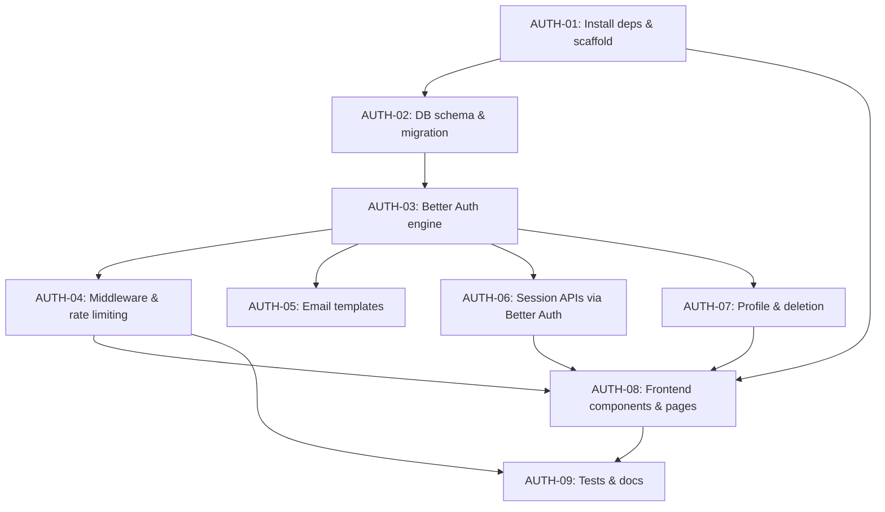

# Authentication & Account Lifecycle Kit — Implementation Plan

## Goal Description

Build a **production-ready, modular authentication and account lifecycle baseline** for modern web applications based on the approved TDD, PRD, Task Breakdown, and Architecture documents. The system will cover the complete user lifecycle: registration, email verification, OAuth login, session management, password recovery, profile management, and account deletion.

**Current State (what already exists):**
- `frontend/` — Next.js 16.4 (App Router) scaffolded with Tailwind CSS. Only the default Next.js boilerplate `page.tsx` exists. No auth pages, no components, no middleware, no auth-client.
- `backend/` — Express server scaffolded. Has `src/lib/auth.ts` (Better Auth config with Google, GitHub, 2FA), `src/lib/db.ts` (PostgreSQL Pool), `src/lib/email.ts` (Resend), `src/routes/auth.router.ts` (Better Auth handler). **Missing**: rate-limiting, validators, types, and all backend dependencies (packages not installed, no `package.json` scripts, no `better-auth`, `express`, `pg`, etc. in `package.json`).

---

## User Review Required

> [!IMPORTANT]
> The `backend/package.json` currently only lists devDependencies (TypeScript, types). It has **no runtime dependencies** (`express`, `better-auth`, `pg`, `resend`, `cors`, `dotenv`, `@upstash/ratelimit`, `@upstash/redis`). We need to install all of these. **Please confirm before proceeding.**

> [!IMPORTANT]
> The document mentions both **PostgreSQL** (in the TDD tech stack and decisions section) and **MongoDB** (in some architecture sections — likely a copy-paste inconsistency). Your `db.ts` uses `pg` (PostgreSQL). **We will proceed with PostgreSQL as the canonical database choice**, consistent with the tech stack decision section. Please confirm.

> [!WARNING]
> The frontend uses **Next.js 16.4** with **Tailwind CSS v4** and **HeroUI**. HeroUI is not yet installed. We will install it as part of AUTH-01/AUTH-08 work. Tailwind v4 has a different configuration approach (no `tailwind.config.js` needed). This plan accounts for that.

> [!IMPORTANT]
> **You will need to fill in real credentials** in `backend/.env` for the app to be fully functional:
> - `DATABASE_URL` — a real PostgreSQL connection string
> - `BETTER_AUTH_SECRET` — a 32+ char random secret
> - `RESEND_API_KEY` — from resend.com
> - `GOOGLE_CLIENT_ID` / `GOOGLE_CLIENT_SECRET` — from Google Cloud Console
> - `GITHUB_CLIENT_ID` / `GITHUB_CLIENT_SECRET` — from GitHub OAuth Apps
> - `UPSTASH_REDIS_REST_URL` / `UPSTASH_REDIS_REST_TOKEN` — from upstash.com

---

## Open Questions

> [!IMPORTANT]
> **Optional Features (2FA, Dark/Light Mode, S3 Avatar Upload)** — Should these be included in this implementation? The TDD marks them as "Optional". For this plan, we will **include 2FA** (Better Auth plugin is already configured) and **Dark/Light mode toggle** as they are low-cost additions. S3 avatar upload will be **deferred** unless you confirm otherwise.

> [!IMPORTANT]
> **Frontend `.env` file** — The frontend needs an env file with `NEXT_PUBLIC_API_URL` (pointing to the backend). Should this be `http://localhost:5000` for dev? We will create a `frontend/.env.example` and `frontend/.env.local` with that default.

---

## Proposed Changes

### Phase 1 — AUTH-01: Backend Dependency Installation & Frontend Structure

---

#### [MODIFY] `backend/package.json`

Replace the current stub with a proper package.json including all runtime dependencies:

```json
{
  "name": "backend",
  "version": "1.0.0",
  "type": "module",
  "scripts": {
    "dev": "tsx watch src/server.ts",
    "build": "tsc",
    "start": "node dist/server.js",
    "test": "vitest"
  },
  "dependencies": {
    "better-auth": "^1.2.7",
    "cors": "^2.8.5",
    "dotenv": "^16.5.0",
    "express": "^4.21.2",
    "pg": "^8.16.3",
    "resend": "^4.5.2",
    "@upstash/ratelimit": "^2.0.5",
    "@upstash/redis": "^1.34.9",
    "zod": "^3.24.1"
  },
  "devDependencies": {
    "@types/cors": "^2.8.17",
    "@types/express": "^5.0.3",
    "@types/node": "^22.0.0",
    "@types/pg": "^8.11.14",
    "tsx": "^4.19.4",
    "typescript": "^5.7.3",
    "vitest": "^3.2.4",
    "supertest": "^7.1.0",
    "@types/supertest": "^6.0.3"
  }
}
```

#### [NEW] `backend/tsconfig.json` (update)

Ensure proper ESM module resolution for the project.

---

#### [NEW] `frontend/.env.example` & `frontend/.env.local`

```env
NEXT_PUBLIC_API_URL=http://localhost:5000
NEXT_PUBLIC_APP_URL=http://localhost:3000
```

#### [NEW] `frontend/src/` — Full directory scaffold

Create the folder structure per TDD:
```
src/
├── app/
│   ├── (auth)/
│   │   ├── login/page.tsx
│   │   ├── register/page.tsx
│   │   ├── forgot-password/page.tsx
│   │   ├── reset-password/page.tsx
│   │   └── verify-email/page.tsx
│   ├── (dashboard)/
│   │   ├── profile/page.tsx
│   │   └── sessions/page.tsx
│   ├── layout.tsx        ← update with HeroUI providers
│   └── page.tsx          ← Landing/home page
├── components/
│   ├── auth/
│   │   ├── LoginForm.tsx
│   │   ├── RegisterForm.tsx
│   │   ├── SocialAuthButtons.tsx
│   │   ├── TwoFactorSetup.tsx
│   │   ├── SessionList.tsx
│   │   ├── ChangePasswordForm.tsx
│   │   └── DeleteAccountModal.tsx
│   └── ui/               ← shared UI primitives
├── lib/
│   └── auth-client.ts    ← Better Auth client
├── middleware.ts          ← Route protection
├── types/
│   └── index.ts
└── validators/
    └── auth.schema.ts
```

---

### Phase 2 — AUTH-02: PostgreSQL Connection & Schema

---

#### [MODIFY] `backend/src/lib/db.ts`

Upgrade from bare `Pool` to a singleton pattern with connection pooling settings and Better Auth-compatible adapter:

```typescript
import { Pool } from "pg";

const globalForDb = globalThis as unknown as { db: Pool };

export const db = globalForDb.db || new Pool({
    connectionString: process.env.DATABASE_URL,
    max: 10,
    min: 2,
    idleTimeoutMillis: 30000,
    connectionTimeoutMillis: 5000,
});

if (process.env.NODE_ENV !== "production") globalForDb.db = db;
```

#### [NEW] `backend/src/lib/schema.sql`

SQL migration file to create all Better Auth tables:

```sql
-- Users table
CREATE TABLE IF NOT EXISTS "user" (
  id TEXT PRIMARY KEY,
  name TEXT NOT NULL,
  email TEXT NOT NULL UNIQUE,
  "emailVerified" BOOLEAN NOT NULL DEFAULT false,
  image TEXT,
  "createdAt" TIMESTAMP NOT NULL DEFAULT NOW(),
  "updatedAt" TIMESTAMP NOT NULL DEFAULT NOW()
);

-- Accounts table (credentials + OAuth)
CREATE TABLE IF NOT EXISTS "account" (
  id TEXT PRIMARY KEY,
  "accountId" TEXT NOT NULL,
  "providerId" TEXT NOT NULL,
  "userId" TEXT NOT NULL REFERENCES "user"(id) ON DELETE CASCADE,
  "accessToken" TEXT,
  "refreshToken" TEXT,
  "idToken" TEXT,
  "accessTokenExpiresAt" TIMESTAMP,
  "refreshTokenExpiresAt" TIMESTAMP,
  scope TEXT,
  password TEXT,
  "createdAt" TIMESTAMP NOT NULL DEFAULT NOW(),
  "updatedAt" TIMESTAMP NOT NULL DEFAULT NOW()
);

-- Sessions table
CREATE TABLE IF NOT EXISTS "session" (
  id TEXT PRIMARY KEY,
  "expiresAt" TIMESTAMP NOT NULL,
  token TEXT NOT NULL UNIQUE,
  "createdAt" TIMESTAMP NOT NULL DEFAULT NOW(),
  "updatedAt" TIMESTAMP NOT NULL DEFAULT NOW(),
  "ipAddress" TEXT,
  "userAgent" TEXT,
  "userId" TEXT NOT NULL REFERENCES "user"(id) ON DELETE CASCADE
);

-- Verifications table
CREATE TABLE IF NOT EXISTS "verification" (
  id TEXT PRIMARY KEY,
  identifier TEXT NOT NULL,
  value TEXT NOT NULL,
  "expiresAt" TIMESTAMP NOT NULL,
  "createdAt" TIMESTAMP NOT NULL DEFAULT NOW(),
  "updatedAt" TIMESTAMP NOT NULL DEFAULT NOW()
);

-- Two-Factor Auth table (for Better Auth twoFactor plugin)
CREATE TABLE IF NOT EXISTS "twoFactor" (
  id TEXT PRIMARY KEY,
  secret TEXT NOT NULL,
  uri TEXT NOT NULL,
  enabled BOOLEAN NOT NULL DEFAULT false,
  "userId" TEXT NOT NULL REFERENCES "user"(id) ON DELETE CASCADE,
  "backupCodes" TEXT
);

-- Indexes
CREATE UNIQUE INDEX IF NOT EXISTS user_email_idx ON "user"(email);
CREATE INDEX IF NOT EXISTS session_user_id_idx ON "session"("userId");
CREATE UNIQUE INDEX IF NOT EXISTS session_token_idx ON "session"(token);
CREATE UNIQUE INDEX IF NOT EXISTS account_provider_idx ON "account"("providerId", "accountId");
CREATE INDEX IF NOT EXISTS verification_identifier_idx ON "verification"(identifier);
```

#### [NEW] `backend/src/lib/migrate.ts`

A one-shot migration runner script.

---

### Phase 3 — AUTH-03: Better Auth Engine (already configured, enhance)

---

#### [MODIFY] `backend/src/lib/auth.ts`

Enhance with Better Auth's `pg` adapter (required to connect Better Auth to PostgreSQL properly), session config, and device capture:

```typescript
import { betterAuth } from "better-auth";
import { twoFactor } from "better-auth/plugins";
import { pg } from "better-auth/adapters/pg";   // ← use official PG adapter
import { db } from "./db.js";
import { sendEmail } from "./email.js";

export const auth = betterAuth({
    database: pg(db),                          // ← wrap with pg adapter
    secret: process.env.BETTER_AUTH_SECRET!,
    baseURL: process.env.APP_BASE_URL!,
    trustedOrigins: [process.env.FRONTEND_URL || "http://localhost:3000"],
    session: {
        cookieCache: { enabled: true, maxAge: 60 },  // Redis-like in-memory cache
        expiresIn: 60 * 60 * 24 * 7,                 // 7 days
        updateAge: 60 * 60 * 24,                      // refresh daily
    },
    emailAndPassword: {
        enabled: true,
        requireEmailVerification: true,
        async sendResetPassword({ user, url }) { ... },
    },
    emailVerification: {
        async sendVerificationEmail({ user, url }) { ... },
    },
    socialProviders: { google: {...}, github: {...} },
    plugins: [twoFactor({ issuer: "AuthLifecycleKit" })],
    advanced: {
        useSecureCookies: process.env.NODE_ENV === "production",
        cookiePrefix: "auth_kit",
        generateId: () => crypto.randomUUID(),
    },
});
```

#### [MODIFY] `backend/src/server.ts`

Add `helmet` for security headers and fix middleware ordering (JSON parsing must come **before** route handlers, and Better Auth needs the raw body):

```typescript
import express from "express";
import cors from "cors";
import helmet from "helmet";
import dotenv from "dotenv";
import { authRouter } from "./routes/auth.router.js";

dotenv.config();

const app = express();

// Security headers
app.use(helmet({ contentSecurityPolicy: false }));

// CORS - credentials required for cookies
app.use(cors({
    origin: process.env.FRONTEND_URL || "http://localhost:3000",
    credentials: true,
}));

// Better Auth must handle /api/auth/* BEFORE express.json()
app.use("/api/auth", authRouter);

// JSON body parsing for all other routes
app.use(express.json());

app.get("/health", (req, res) => res.json({ status: "ok" }));

const PORT = process.env.PORT || 5000;
app.listen(PORT, () => console.log(`✅ Server running on ${process.env.APP_BASE_URL}`));
```

---

### Phase 4 — AUTH-04: Middleware Route Protection & Rate Limiting

---

#### [NEW] `backend/src/lib/rate-limit.ts`

Sliding-window rate limiter using Upstash Redis:

```typescript
import { Ratelimit } from "@upstash/ratelimit";
import { Redis } from "@upstash/redis";

const redis = new Redis({
    url: process.env.UPSTASH_REDIS_REST_URL!,
    token: process.env.UPSTASH_REDIS_REST_TOKEN!,
});

// 5 attempts per 15 minutes per IP
export const authRateLimiter = new Ratelimit({
    redis,
    limiter: Ratelimit.slidingWindow(5, "15 m"),
    analytics: true,
    prefix: "auth_kit:rl",
});

export async function rateLimitMiddleware(req: Request, res: Response, next: NextFunction) {
    const ip = req.ip || "anonymous";
    const { success, reset } = await authRateLimiter.limit(ip);
    if (!success) {
        const retryAfter = Math.ceil((reset - Date.now()) / 1000);
        return res.status(429).json({
            error: "Too many requests. Please try again later.",
            retryAfter,
        });
    }
    next();
}
```

#### [MODIFY] `backend/src/routes/auth.router.ts`

Apply rate limiting to sensitive auth endpoints:

```typescript
import { Router } from "express";
import { toNodeHandler } from "better-auth/node";
import { auth } from "../lib/auth.js";
import { rateLimitMiddleware } from "../lib/rate-limit.js";

export const authRouter = Router();

// Rate-limit sensitive endpoints
authRouter.post("/sign-in/*", rateLimitMiddleware);
authRouter.post("/sign-up/*", rateLimitMiddleware);
authRouter.post("/forget-password", rateLimitMiddleware);
authRouter.post("/reset-password", rateLimitMiddleware);

// Better Auth handles all /api/auth/* routes
authRouter.all("*", toNodeHandler(auth));
```

#### [NEW] `frontend/src/middleware.ts`

Next.js middleware to protect dashboard routes:

```typescript
import { NextRequest, NextResponse } from "next/server";

const PROTECTED_ROUTES = ["/profile", "/sessions"];
const AUTH_ROUTES = ["/login", "/register", "/forgot-password"];

export async function middleware(request: NextRequest) {
    const { pathname } = request.nextUrl;
    const sessionToken = request.cookies.get("auth_kit.session_token");

    const isProtected = PROTECTED_ROUTES.some(r => pathname.startsWith(r));
    const isAuthPage = AUTH_ROUTES.some(r => pathname.startsWith(r));

    if (isProtected && !sessionToken) {
        return NextResponse.redirect(new URL(`/login?callbackUrl=${pathname}`, request.url));
    }

    if (isAuthPage && sessionToken) {
        return NextResponse.redirect(new URL("/profile", request.url));
    }

    return NextResponse.next();
}

export const config = {
    matcher: ["/((?!api|_next/static|_next/image|favicon.ico).*)"],
};
```

---

### Phase 5 — AUTH-05: Email Service (already configured, enhance templates)

---

#### [MODIFY] `backend/src/lib/email.ts`

Upgrade with proper branded HTML email templates:

```typescript
import { Resend } from "resend";

export const resend = new Resend(process.env.RESEND_API_KEY);

export async function sendEmail({ to, subject, html }: EmailOptions) { ... }

export function verificationEmailTemplate(url: string): string {
    return `<html>...branded template with verify link...</html>`;
}

export function passwordResetTemplate(url: string): string {
    return `<html>...branded template with reset link...</html>`;
}
```

---

### Phase 6 — AUTH-06 & AUTH-07: Session Management & Profile APIs

---

Better Auth exposes all session management endpoints out of the box via `/api/auth/list-sessions`, `/api/auth/revoke-session`, `/api/auth/revoke-other-sessions`, and `/api/auth/delete-user`. These are available via the Better Auth client and do not require custom backend routes.

We will expose these via the **Better Auth client** on the frontend. No additional backend routes needed.

---

### Phase 7 — AUTH-08: Frontend Auth UI Components

---

#### [NEW] `frontend/src/lib/auth-client.ts`

```typescript
import { createAuthClient } from "better-auth/react";
import { twoFactorClient } from "better-auth/client/plugins";

export const authClient = createAuthClient({
    baseURL: process.env.NEXT_PUBLIC_API_URL || "http://localhost:5000",
    plugins: [twoFactorClient()],
});

export const {
    signIn, signUp, signOut,
    useSession, getSession,
    forgetPassword, resetPassword, changePassword,
    sendVerificationEmail,
    revokeSession, revokeOtherSessions, listSessions,
    deleteUser,
    twoFactor,
} = authClient;
```

#### [NEW] `frontend/src/validators/auth.schema.ts`

```typescript
import { z } from "zod";

export const loginSchema = z.object({
    email: z.string().email("Invalid email address"),
    password: z.string().min(1, "Password is required"),
});

export const registerSchema = z.object({
    name: z.string().min(2, "Name must be at least 2 characters"),
    email: z.string().email("Invalid email address"),
    password: z.string()
        .min(8, "Password must be at least 8 characters")
        .regex(/[A-Z]/, "Must contain uppercase letter")
        .regex(/[0-9]/, "Must contain a number"),
    confirmPassword: z.string(),
}).refine(d => d.password === d.confirmPassword, {
    message: "Passwords do not match",
    path: ["confirmPassword"],
});

export const forgotPasswordSchema = z.object({ email: z.string().email() });
export const resetPasswordSchema = z.object({
    password: z.string().min(8),
    confirmPassword: z.string(),
}).refine(d => d.password === d.confirmPassword, { message: "Passwords do not match", path: ["confirmPassword"] });

export const changePasswordSchema = z.object({
    currentPassword: z.string().min(1),
    newPassword: z.string().min(8),
    confirmNewPassword: z.string(),
}).refine(d => d.newPassword === d.confirmNewPassword, { message: "Passwords do not match", path: ["confirmNewPassword"] });
```

#### [NEW] Auth Form Components

All components will be built with a **premium dark-mode-first design** using Tailwind CSS v4 and HeroUI:

| Component | Key Features |
|-----------|-------------|
| `LoginForm.tsx` | Email/password fields, Zod validation, "Forgot password?" link, loading state, error toasts |
| `RegisterForm.tsx` | Name/email/password/confirm fields, inline validation errors, success redirect |
| `SocialAuthButtons.tsx` | Google & GitHub OAuth buttons with brand icons |
| `TwoFactorSetup.tsx` | QR code display, TOTP input, backup codes reveal |
| `SessionList.tsx` | Table of active sessions (IP, device, date), revoke buttons, "Logout other devices" |
| `ChangePasswordForm.tsx` | Current + new + confirm password fields |
| `DeleteAccountModal.tsx` | Confirmation modal with password re-entry |

#### [NEW] Auth Pages

| Page | Route | Description |
|------|-------|-------------|
| `login/page.tsx` | `/login` | LoginForm + SocialAuthButtons |
| `register/page.tsx` | `/register` | RegisterForm + SocialAuthButtons |
| `forgot-password/page.tsx` | `/forgot-password` | Email input to trigger reset |
| `reset-password/page.tsx` | `/reset-password?token=...` | New password form |
| `verify-email/page.tsx` | `/verify-email?token=...` | Auto-validates token, shows status |
| `profile/page.tsx` | `/profile` | Profile info + ChangePasswordForm + DeleteAccountModal |
| `sessions/page.tsx` | `/sessions` | SessionList component |

#### [MODIFY] `frontend/src/app/layout.tsx`

Add HeroUI providers, Google Fonts (Inter), and dark mode support.

#### [MODIFY] `frontend/src/app/page.tsx`

Replace default boilerplate with a polished landing page that showcases the kit's features with CTAs to `/login` and `/register`.

---

### Phase 8 — AUTH-09: Types, Testing & Documentation

---

#### [NEW] `backend/src/types/index.ts`

```typescript
export interface AuthUser {
    id: string;
    name: string;
    email: string;
    emailVerified: boolean;
    createdAt: Date;
    updatedAt: Date;
}

export interface ActiveSession {
    id: string;
    userId: string;
    token: string;
    expiresAt: Date;
    ipAddress: string | null;
    userAgent: string | null;
    createdAt: Date;
}
```

#### [NEW] `backend/tests/auth.test.ts`

Tests covering:
- Schema validation (valid/invalid email, weak password)
- Rate limiter threshold simulation
- Token expiry validation

#### [NEW] `frontend/.env.local`

```env
NEXT_PUBLIC_API_URL=http://localhost:5000
NEXT_PUBLIC_APP_URL=http://localhost:3000
```

#### [MODIFY] Root `README.md`

Complete setup documentation covering prerequisites, env setup, DB migration, running backend + frontend, and integration guide.

---

## Implementation Sequence (Dependency Order)



---

## Verification Plan

### Automated Tests

```bash
# Backend unit tests
cd backend && npm test

# Frontend type checking
cd frontend && npx tsc --noEmit
```

### Manual Verification

After implementation, verify each flow end-to-end:

1. **Registration**: Visit `/register` → fill form → check email arrives → click verification link → confirm `/profile` loads
2. **Login**: Visit `/login` → use email/password → confirm redirect to `/profile` with session cookie set (`HttpOnly`, `Secure`)
3. **OAuth**: Click "Sign in with Google" → complete OAuth flow → confirm user created and redirected to `/profile`
4. **Protected routes**: Clear cookies → visit `/profile` → confirm redirect to `/login`
5. **Password reset**: Visit `/forgot-password` → enter email → check email → click link → reset password → confirm login with new password
6. **Session management**: Visit `/sessions` → confirm active sessions listed → revoke a session → confirm it disappears
7. **Rate limiting**: Submit login form 6+ times rapidly → confirm `429` with retry message on 6th attempt
8. **Account deletion**: Visit `/profile` → click "Delete Account" → confirm password → confirm all sessions cleared and redirect to `/login`
9. **2FA**: Visit `/profile` → enable 2FA → scan QR code in authenticator app → confirm TOTP challenge on next login

### Build Check

```bash
cd frontend && npm run build
```
